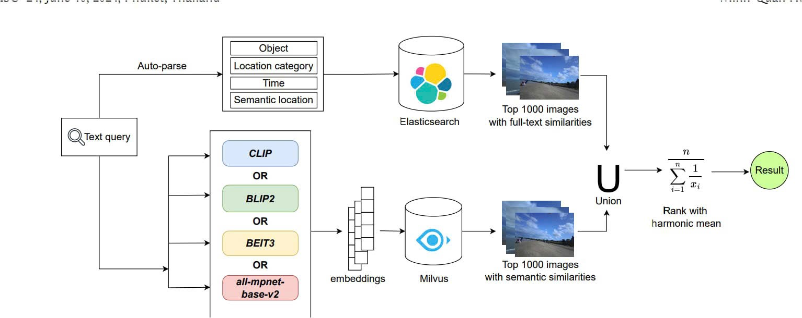
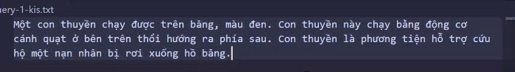
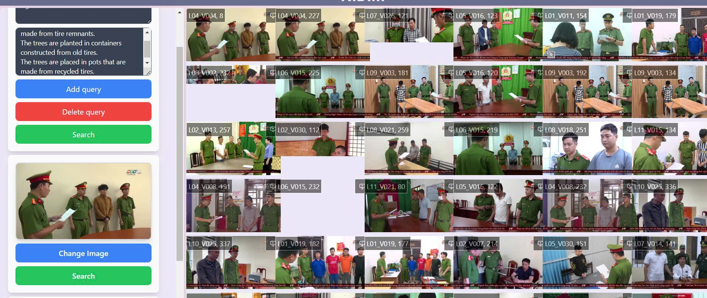
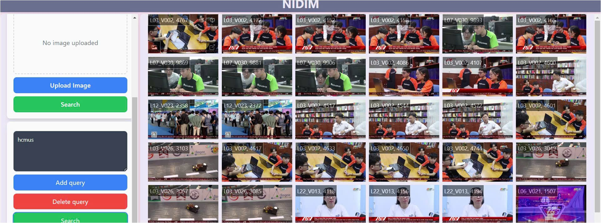
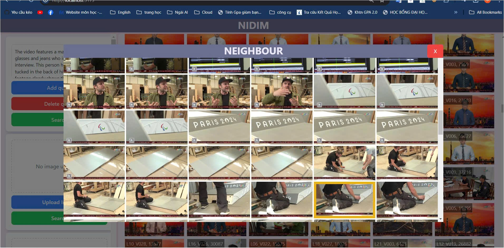
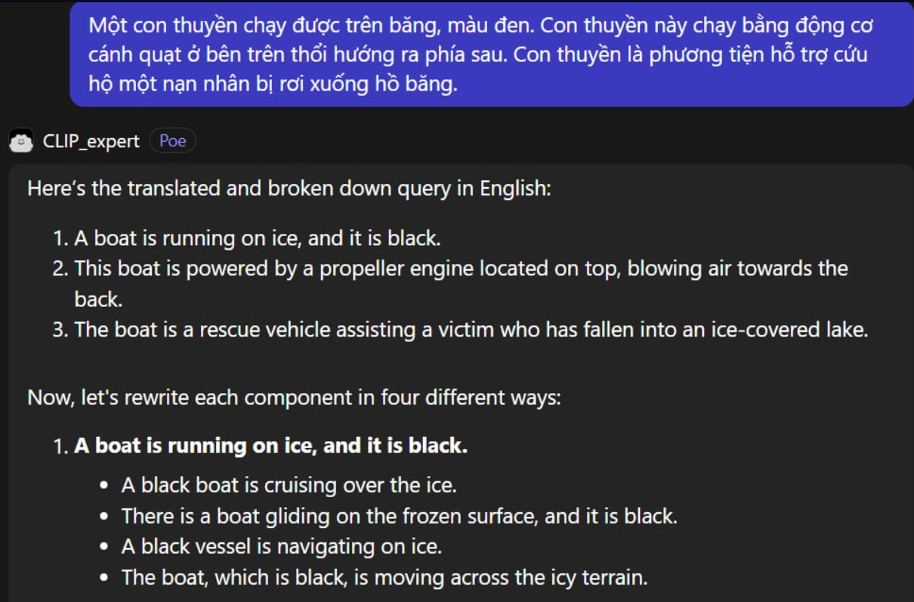

# 🧠 NIDIM -- Video Retrieval by Description (AI Challenge 2024)

## 📘 Giới thiệu

**NIDIM** là hệ thống **tìm kiếm video theo mô tả ngôn ngữ tự nhiên**:\
Bạn mô tả → Hệ thống hiểu → Trả về đoạn video khớp nhất.

Dự án được phát triển để tham gia **AI Challenge 2024**, nơi bài toán
yêu cầu tìm video từ bộ dữ liệu cực lớn dựa trên mô tả hoặc hình ảnh
truy vấn.

------------------------------------------------------------------------

## 🎯 Tính năng nổi bật

-   🔍 **Search đa dạng**:

    -   Tìm bằng văn bản\
    -   Tìm bằng hình ảnh\
    -   Tìm bằng OCR (text trong ảnh/video)\
    -   Tìm dạng *join query* (kết hợp nhiều tín hiệu)

-   🧠 **Hiểu ngữ nghĩa sâu** nhờ embedding CLIP / Sentence
    Transformers.

-   🎞️ **Hiển thị video & frame lân cận** (neighbour frame).\
    → Giúp kiểm chứng ngữ cảnh clip được tìm ra.

-   🖼️ **Giao diện web mượt** (React + TailwindCSS).

------------------------------------------------------------------------

## 🧱 Kiến trúc hệ thống



------------------------------------------------------------------------

## 🧰 Công nghệ sử dụng

  Thành phần   Công nghệ
  ------------ ----------------------------------
  Frontend     React + TailwindCSS + Vite
  Backend      Python (Flask / FastAPI)
  Vector DB    Elasticsearch / Qdrant
  Models       CLIP, Sentence Transformers, OCR
  Triển khai   Docker, Localhost

------------------------------------------------------------------------

## 📦 Cài đặt & Chạy

### 1️⃣ Backend

``` bash
cd server
pip install -r requirements.txt
python server.py
```

### 2️⃣ Frontend

``` bash
cd client
npm install
npm run dev
```

------------------------------------------------------------------------

## 🔍 Demo các loại truy vấn

### 🔹 Text Query



### 🔹 Image Query



### 🔹 OCR Query



### 🔹 Neighbour Frames



### 🔹 Prompt Breakdown (LLM)



### 🔹 Demo Video

[](./docs/demo_ytb.mp4)

------------------------------------------------------------------------

## 🧩 Example Query Breakdown

**Query gốc từ ban tổ chức:**\
\> "Một người đang bắt con sứa vàng dưới nước. Sau đó, người này đưa con
sứa cho một người khác trên thuyền."

**LLM xử lý → phân rã thành:**\
- Một người bắt con sứa vàng dưới nước\
- Người này đưa con sứa cho người khác trên thuyền

→ Mỗi đoạn được rewrite thành nhiều biến thể để tăng độ khớp khi truy
vấn.

------------------------------------------------------------------------

## 📤 Export Result Example

Hệ thống cho phép **xuất file .txt** chứa annotation từng frame:\
Ví dụ (trích):

    frame_00123: person catching yellow jellyfish underwater
    frame_00124: underwater jellyfish interaction
    frame_00125: person handing jellyfish to someone on boat
    ...

------------------------------------------------------------------------

## 🔬 Pipeline Hoạt động

1.  Người dùng nhập mô tả / tải ảnh\
2.  Backend tạo embedding → truy vấn Vector DB\
3.  Elasticsearch/Qdrant trả về các frame/clip gần nhất\
4.  Client render video + frame lân cận\
5.  Người dùng có thể export kết quả

------------------------------------------------------------------------

⭐ Nếu bạn thấy dự án hữu ích, hãy **star repo** để ủng hộ nhóm nhé! ⭐
